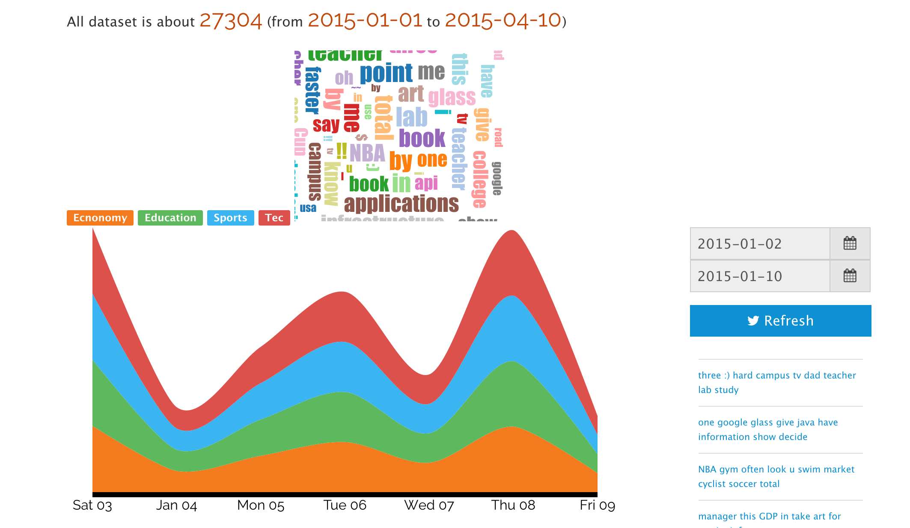

#Visual Analysis of Topic Competition on Social Media

##Motivation

This project is done as a non-fully implementation of Panpan Xu's [Visual Analysis of Topic Competition on Social Media](http://ieeexplore.ieee.org/xpls/abs_all.jsp?arnumber=6634134).

##Project Structure

This project is based `Play` framework, combined with `Apache Spark` as data processing engine, and built using `activator`.The dependencies are listed in `build.sbt`.

The twitter data is generated by `python3` script, which is in `date-generating` folder.

##Others

Since I just use it as a demo of [Visual Analysis of Topic Competition on Social Media](http://ieeexplore.ieee.org/xpls/abs_all.jsp?arnumber=6634134), the data used is all simulated.

Thanks to [d3js](http://d3js.org/)'s powerful visualization components.

Here is a screenshot：

